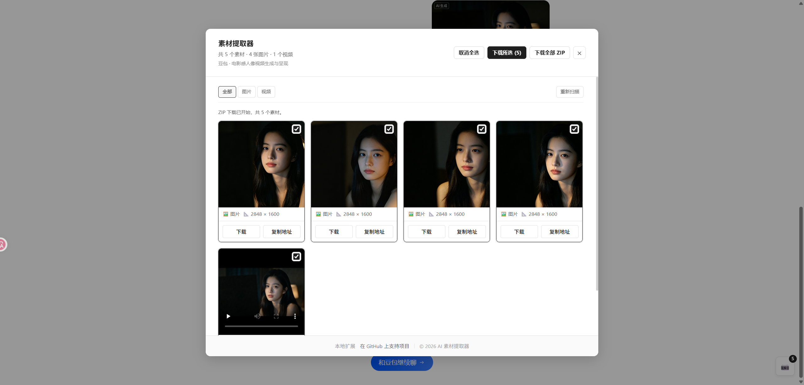
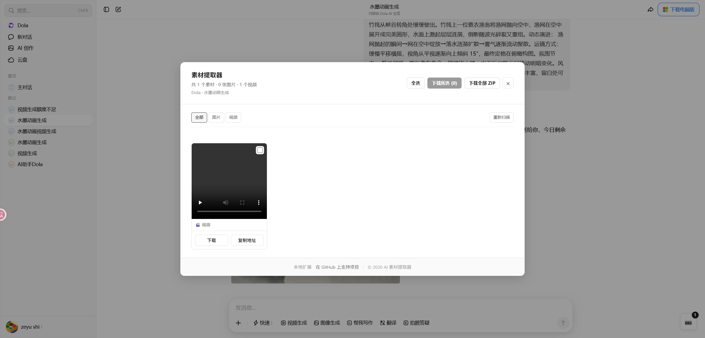
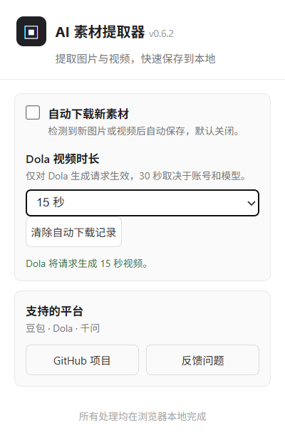

# AI Media Extractor

浏览器扩展，用于从豆包、Dola 和千问页面提取图片与视频资源，并支持手动或自动下载。

[](https://github.com/scj725/ai-media-extractor/releases)
[](LICENSE)

## 为什么使用

- 无需本地服务器，安装后在已登录页面直接使用。
- 支持图片、视频筛选，批量选择、批量下载和 ZIP 打包。
- 自动按平台、对话标题和序号命名，素材更容易整理。
- 下载显示进度，失败后可以直接重试。
- 支持重新扫描、复制地址和自动下载新素材。
- Edge 和 Firefox 功能保持同步。

## 界面预览

素材面板支持图片、视频混合展示、筛选、批量选择和 ZIP 下载：



Dola 视频页面可以单独查看和下载视频素材：



扩展弹窗用于管理自动下载和 Dola 视频时长：



## 支持平台

- 豆包：`www.doubao.com/thread/*`、`www.doubao.com/chat/*`
- Dola：`www.dola.com/chat/*`
- 千问：`www.qianwen.com/chat/*`、`www.qianwen.com/share/chat/*`、`qianwen.my.cn/share/chat/*`

扩展运行在用户已登录的目标页面中，不需要本地服务器或额外运行时。

## 安装

### Chrome / Edge

1. 打开 `chrome://extensions/` 或 `edge://extensions/`。
2. 开启“开发者模式”。
3. 点击“加载已解压的扩展程序”。
4. 选择 `extension/edge` 目录。

### Firefox

1. 打开 `about:debugging#/runtime/this-firefox`。
2. 点击“临时载入附加组件”。
3. 选择 `extension/firefox/manifest.json`。

登录目标平台后刷新页面，点击页面右下角的素材按钮即可使用。面板会显示当前平台和对话标题，可按图片/视频筛选，点击“重新扫描”重新读取当前页面。扩展弹窗中可以开启新素材自动下载，设置保存在浏览器本地。

## 打包

在 Windows PowerShell 中执行：

```powershell
./scripts/package-extensions.ps1
```

ZIP 文件会生成在 `dist/` 目录，分别对应 Chrome、Edge 和 Firefox。GitHub Actions 也会在推送 `v*` 标签时自动打包并发布附件。

## 反馈与贡献

遇到平台页面结构变化、下载失败或新的适配需求，请提交 [Issue](https://github.com/scj725/ai-media-extractor/issues)，附上浏览器版本、目标平台、页面类型和可复现步骤，不要提交 Cookie、Token 或聊天内容。欢迎提交 Pull Request，详见 [CONTRIBUTING.md](CONTRIBUTING.md)。

QQ群：`771436309`

## 隐私

扩展只处理匹配页面中的媒体请求，不会向开发者服务器上传聊天内容、媒体、Cookie 或账号信息。详细说明见 [docs/PRIVACY_POLICY.md](docs/PRIVACY_POLICY.md)。

## 许可

本项目基于 [ihmily/doubao-nomark](https://github.com/ihmily/doubao-nomark) 的 MIT 许可证代码修改而来。分发时请保留 [LICENSE](LICENSE)。

使用扩展时请遵守目标平台的服务条款及相关法律法规，仅处理你有权访问和保存的内容。
